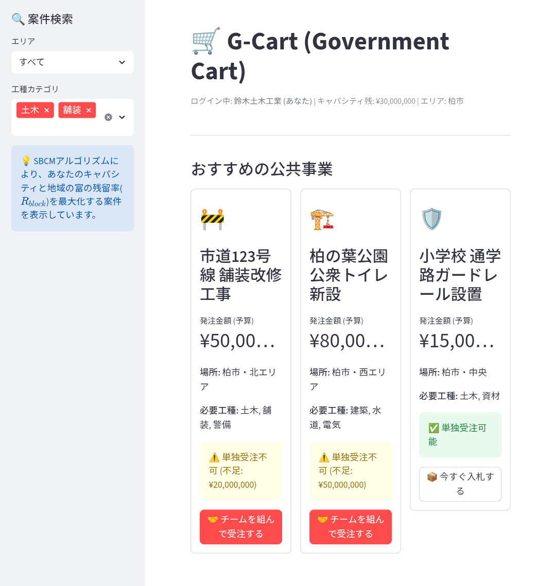
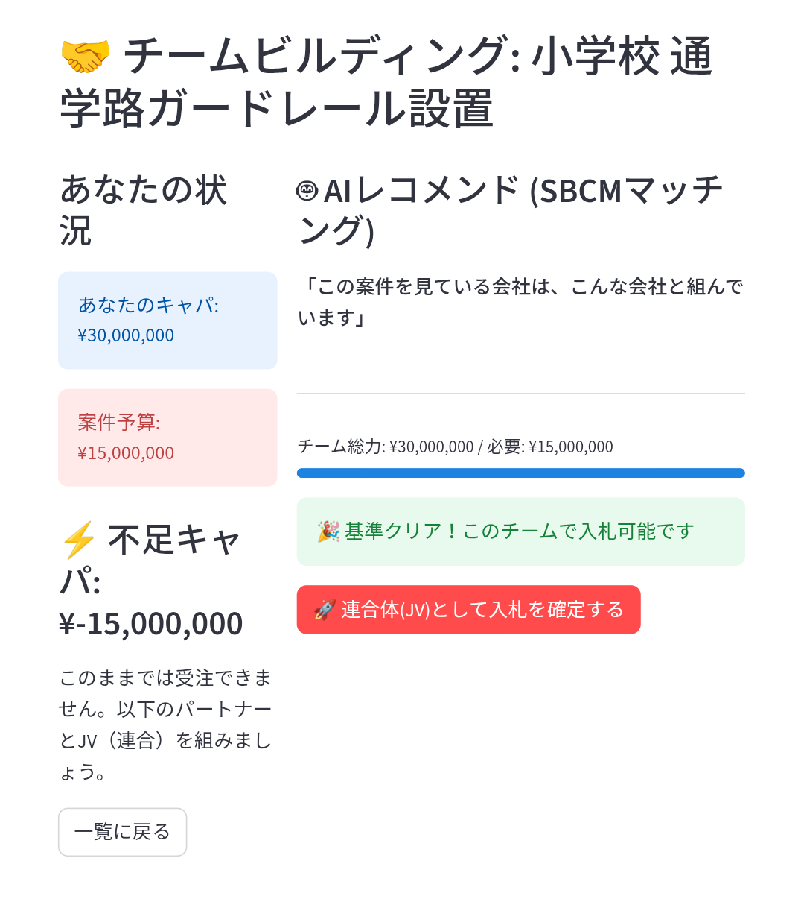

# G-Cart: The Virtual General Contractor System
### 🏗️ Democratizing Public Procurement via Algorithms

[](https://doi.org/10.5281/zenodo.17766604)
[](https://streamlit.io)
[](https://opensource.org/licenses/MIT)

**「G-Cart」は、SBCM経済学に基づき設計された、世界初の「バーチャル・ゼネコン」プラットフォームです。**
AmazonのようなECサイト風UIを通じて、地方の中小企業がアルゴリズムで瞬時に連携（JV）し、巨大な公共事業を直接受注することを可能にします。

---

## 📖 概要 (Overview)

従来の公共事業は、巨大な「ゼネコン（総合建設業）」を頂点とするピラミッド構造でした。
これにより、地方に投下された予算の多くが「管理費」や「丸投げ手数料」として中央（東京）に流出する**「ストロー効果 (The Straw Effect)」**が発生していました。

**G-Cartは、この「ゼネコン機能」をソフトウェアで代替します。**

*   **Before:** 役所 → ゼネコン → 1次下請け → 2次下請け... (多重搾取)
*   **After (G-Cart):** 役所 → **[G-Cart アルゴリズム]** → 地域中小企業連合 (直接分配)

## 💡 なぜ作るのか (The Philosophy)

本システムは、**SBCM経済学 (Standard Block Comparison Method Economics)** の理論的帰結として実装されました。

1.  **漏出の阻止:** 地域内残留率 ($R_{block}$) を最大化するため、地元の企業同士を優先的にマッチングします。
2.  **キャパシティの合成:** 中小企業単独 ($C_{single}$) では受けられない巨大案件 ($I_{budget}$) も、複数社を束ねることで受注可能にします ($\Sigma C \ge I$)。
3.  **中抜きの排除:** マッチングと契約を自動化し、中間マージンをゼロにします。

## 🚀 機能 (Features)

### 1. ECサイト風インターフェース (Shopping UI)
入札は「買い物」のようにシンプルであるべきです。
難解な仕様書を読み解く必要はありません。Amazonでポチる感覚で、公共事業を「カート」に入れられます。

### 2. AI JVマッチング (Algorithmic Joint Venture)
「この商品（土木工事）を買う人は、こちらの商品（舗装工事）も一緒に...」
ECサイトのレコメンド機能を応用し、足りない工種やキャパシティを持つ近隣企業を自動提案します。
これにより、**「バーチャルなゼネコン」**が瞬時に組成されます。

### 3. SBCMキャパシティ判定
企業の基礎体力（標準ブロック係数）に基づき、無理な受注（歪み）を未然に防ぎます。
- **キャパオーバー:** ⚠️「単独受注不可」→ パートナー提案へ
- **キャパ内:** ✅「即時入札可能」

## 🛠️ インストールと実行 (Installation)

Python環境があれば、すぐにローカルで「バーチャル・ゼネコン」を立ち上げられます。

```bash
# 1. リポジトリをクローン
git clone https://github.com/your-name/G-Cart.git
cd G-Cart

# 2. 依存ライブラリをインストール
pip install -r requirements.txt

# 3. アプリを起動
streamlit run app.py
```

## 📊 SBCM理論との関係

このシステムは、以下の論文で提唱された理論の実装版です。

> **Koyama, H. (2025).** *SBCM Economics: A Meso-Economic Framework for Maximizing Wealth Retention and Circulation.*
> Zenodo. [https://doi.org/10.5281/zenodo.17766604](https://doi.org/10.5281/zenodo.17766604)

- **Theory:** 公共事業の巨大化は、地域経済からの富の漏出（ストロー効果）を招く。
- **Solution (G-Cart):** 巨大発注をアルゴリズムで分解・再統合（Unbundling & Re-bundling）し、地域内循環を強制する。

## 📷 スクリーンショット

| 案件一覧 (Amazon風) | チームビルディング (Tinder風) |
| :---: | :---: |
|  |  |
| *「単独受注不可」を可視化* | *足りないピースを自動マッチング* |

## 📚 Theoretical Background
G-Cartのアルゴリズムは、地域経済の「漏出（Leakage）」を防ぐための経済理論 **SBCM Economics** に基づいています。
なぜこのシステムが地方創生に必要なのか、その数学的証明はこちらをご覧ください。

👉 **[理論仕様書 (Theory & Logic)](docs/THEORY.md)**

## 📝 ライセンス

[MIT License](LICENSE)
どなたでも自由にフォークし、地域の公共調達システムとして導入できます。

---
**Author:** Hokuto Koyama
```
